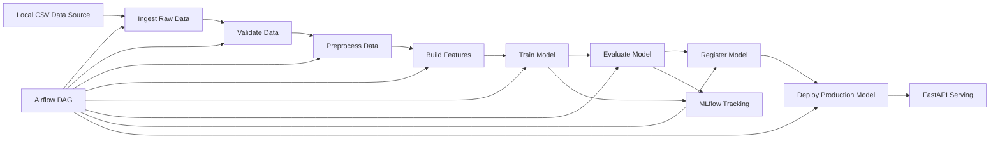

# Customer Churn Prediction System  
### MLOps Project for Batch Training, Tracking, Deployment, and Serving

## 1. Project Overview

**Customer Churn Prediction System** là một đồ án MLOps được xây dựng nhằm dự đoán khả năng khách hàng rời bỏ dịch vụ hay không dựa trên dữ liệu hành vi và thông tin thuê bao.

Dự án tập trung vào việc triển khai **một quy trình MLOps đơn giản nhưng đầy đủ**, phù hợp với quy mô đồ án sinh viên, dễ hiểu, dễ triển khai local, dễ demo và dễ mở rộng sau này.

Hệ thống được thiết kế theo hướng:

- xử lý dữ liệu theo **batch pipeline**
- huấn luyện mô hình học máy
- theo dõi thí nghiệm bằng **MLflow**
- điều phối workflow bằng **Airflow**
- phục vụ dự đoán qua **FastAPI**
- triển khai cục bộ bằng **Docker Compose**

## 2. Problem Statement

Trong thực tế, churn prediction là một bài toán quan trọng trong các lĩnh vực viễn thông, tài chính, bảo hiểm và dịch vụ số. Việc phát hiện sớm khách hàng có xu hướng rời bỏ giúp doanh nghiệp:

- giảm tỷ lệ mất khách hàng
- tối ưu chi phí giữ chân khách hàng
- tăng hiệu quả chiến dịch chăm sóc khách hàng
- cải thiện doanh thu dài hạn

Trong đồ án này, bài toán được xây dựng như một hệ thống hoàn chỉnh từ dữ liệu đầu vào đến mô hình dự đoán và API phục vụ.

---

## 3. Project Objectives

Mục tiêu của dự án bao gồm:

- xây dựng pipeline xử lý dữ liệu từ file nguồn local
- huấn luyện mô hình churn prediction
- đánh giá chất lượng mô hình bằng các metric chuẩn
- lưu lại params, metrics và lịch sử train bằng MLflow
- triển khai model serving qua FastAPI
- orchestration toàn bộ workflow bằng Airflow
- tối giản kiến trúc để phù hợp với đồ án sinh viên

---

## 4. Design Principles

Dự án được refactor theo các nguyên tắc sau:

- **đơn giản hơn là phức tạp**
- **thực thi được hơn là over-engineering**
- **phù hợp đồ án sinh viên**
- **ưu tiên local deployment bằng Docker Compose**
- **không sử dụng công nghệ không cần thiết cho bài toán batch nhỏ**

Vì vậy, hệ thống  **sử dụng**:

- Airflow
- MLflow
- FastAPI
- Docker Compose
- Python, Pandas, Scikit-learn

---

## 5. System Architecture

### 5.1 Architecture Summary

Hệ thống gồm 4 lớp chính:

1. **Data Layer**  
   Chứa dữ liệu nguồn, raw data, processed data và feature dataset.

2. **Pipeline Layer**  
   Gồm các script xử lý dữ liệu, training, evaluation, register và deploy model.

3. **Orchestration Layer**Airflow chịu trách nhiệm điều phối toàn bộ workflow end-to-end.

4. **Serving Layer**  
   FastAPI load production model và cung cấp REST API để dự đoán churn.

### 5.2 Architecture Diagram



### 5.3 End-to-End Data Flow

Luồng dữ liệu của hệ thống như sau:

1. Dữ liệu gốc được đặt trong thư mục `data-pipeline/data/Newdata/`
2. Script `ingest.py` copy dữ liệu vào `raw/`
3. Script `validate.py` kiểm tra chất lượng dữ liệu đầu vào
4. Script `preprocess.py` làm sạch dữ liệu và tạo dataset đã xử lý
5. Script `build_features.py` sinh feature dataset phục vụ mô hình
6. Script `train.py` huấn luyện Logistic Regression
7. Script `evaluate.py` tính các metric đánh giá mô hình
8. Script `register.py` quyết định có promote model mới hay không
9. Script `deploy.py` cập nhật production model
10. FastAPI load model production để phục vụ inference
11. Airflow orchestration toàn bộ quy trình trên

---

## 6. Technology Stack

| Layer | Technology |
|---|---|
| Data Processing | Python, Pandas |
| Machine Learning | Scikit-learn |
| Experiment Tracking | MLflow |
| Workflow Orchestration | Apache Airflow |
| Model Serving | FastAPI |
| Containerization | Docker Compose |
| Storage | Local files, SQLite, MLflow artifacts |

---

## 7. Project Structure

```text
folder/
├── artifacts/
│   ├── metrics/
│   ├── models/
│   └── reports/
├── configs/
├── data-pipeline/
│   ├── data/
│   │   ├── Newdata/
│   │   ├── raw/
│   │   ├── processed/
│   │   └── features/
│   └── scripts/
├── infra/
│   └── docker/
│       └── airflow/
│           ├── dags/
│           ├── config/
│           ├── .env
│           ├── docker-compose.yaml
│           └── requirements.txt
├── mlruns/
├── model_pipeline/
│   └── src/
├── registry/
│   └── production/
├── serving_pipeline/
│   └── api/
├── mlflow.db
└── README.md
```

---

## 8. Main Components

### 8.1 Data Pipeline

Các bước xử lý dữ liệu chính được cài đặt trong thư mục:

```text
data-pipeline/scripts/
```

#### `ingest.py`
- đọc file nguồn
- sao chép dữ liệu vào thư mục `raw`
- tạo file `latest.csv`

#### `validate.py`
- kiểm tra schema
- kiểm tra cột bắt buộc- kiểm tra số dòng
- kiểm tra null values
- sinh report validation

#### `preprocess.py`
- xử lý missing values
- chuẩn hóa kiểu dữ liệu
- chuyển đổi target
- làm sạch dữ liệu

#### `build_features.py`
- sinh các feature mới
- ví dụ:
  - `Tenure_Group`
  - `Avg_Monthly_Spend`
  - `Support_to_Usage_Ratio`
  - `High_Payment_Delay`
  - `Inactive_Recently`

### 8.2 Model Pipeline

Các bước huấn luyện và triển khai model nằm trong:

```text
model_pipeline/src/
```

#### `train.py`
- đọc feature dataset
- xây dựng pipeline preprocessing + model
- train Logistic Regression
- log params và metrics vào MLflow
- lưu model local

#### `evaluate.py`
- load model đã train
- tính metric đánh giá:
  - accuracy
  - precision
  - recall
  - f1_score
  - roc_auc

#### `register.py`
- so sánh model mới với production model hiện tại
- quyết định có promote model mới hay không

#### `deploy.py`
- copy model mới sang production nếu đạt tiêu chí
- cập nhật metadata của production model

### 8.3 Airflow Orchestration

Airflow DAG chính nằm tại:

```text
infra/docker/airflow/dags/churn_end_to_end_pipeline.py
```

DAG bao gồm các task:

- `ingest_raw_data`
- `validate_data`
- `preprocess_data`
- `build_features`
- `train_model`
- `evaluate_model`
- `register_model`
- `deploy_model`

Airflow chịu trách nhiệm:
- điều phối đúng thứ tự chạy
- theo dõi trạng thái task
- cho phép rerun task hoặc rerun toàn bộ pipeline
- lưu lịch sử các lần chạy

### 8.4 MLflow Tracking

MLflow được sử dụng để:
- lưu experiment
- lưu params
- lưu metrics
- theo dõi lịch sử huấn luyện
- hỗ trợ quan sát kết quả các lần train model

Experiment chính:

```text
customer_churn_training
```

### 8.5 FastAPI Serving

FastAPI được sử dụng để phục vụ model production qua REST API.

Các endpoint chính:

#### `GET /health`
Kiểm tra trạng thái hoạt động của service.

#### `POST /predict`
Nhận input khách hàng và trả về:
- nhãn dự đoán churn
- xác suất churn

#### `POST /reload-model`
Reload production model sau khi deploy model mới.

---

## 9. Dataset

Dữ liệu đầu vào chính được đặt tại:

```text
data-pipeline/data/Newdata/customer_churn.csv
```

Dữ liệu được xử lý theo thứ tự:

```text
Newdata -> raw -> processed -> features
```

---

## 10. Model and Evaluation

Mô hình hiện tại:
- **Logistic Regression**

Các metric được sử dụng:
- Accuracy
- Precision
- Recall
- F1-score
- ROC-AUC

Ví dụ kết quả đạt được trong quá trình thực nghiệm:

- Accuracy ≈ 0.896
- Precision ≈ 0.926
- Recall ≈ 0.889
- F1-score ≈ 0.907
- ROC-AUC ≈ 0.961

Kết quả này cho thấy mô hình hoạt động khá tốt đối với phạm vi dữ liệu và bài toán churn prediction trong đồ án.


---## 11. Why This Architecture?

Dự án đã loại bỏ các thành phần phức tạp không cần thiết như Kafka, Spark, MinIO và Kubernetes vì những lý do sau:

### Không dùng Kafka
Bài toán hiện tại là batch processing từ file local, không cần streaming ingestion.

### Không dùng Spark
Dữ liệu không đủ lớn để cần distributed computing. Pandas là đủ và dễ triển khai hơn.

### Không dùng MinIO
Artifact có thể lưu local kết hợp MLflow, không cần object storage riêng.

### Không dùng Kubernetes
Docker Compose là đủ cho đồ án sinh viên và dễ setup hơn nhiều.

Nhờ đó hệ thống:
- nhẹ hơn
- dễ debug hơn
- dễ triển khai hơn
- phù hợp hơn với mục tiêu học tập

---

## 12. MÔI TRƯỜNG

### 12.1 Prerequisites

Yêu cầu cài đặt:

- Python 3.10 hoặc 3.11
- Docker Desktop
- Docker Compose

Cài các package Python cần thiết:

```bash
py -m pip install pandas scikit-learn mlflow fastapi uvicorn pyarrow joblib
```

### 12.2 Run Airflow

```bash
docker compose --env-file .\infra\docker\airflow\.env -f .\infra\docker\airflow\docker-compose.yaml up -d
```

Mở Airflow UI:

```text
http://localhost:8080
```

### 12.3 Run MLflow

Mở PowerShell mới và chạy:

```bash
cd folder
py -m mlflow server --backend-store-uri sqlite:///mlflow.db --default-artifact-root .\mlruns --host 0.0.0.0 --port 5000 --allowed-hosts "localhost:5000,127.0.0.1:5000,host.docker.internal:5000,host.docker.internal:*"
```

Mở MLflow UI:

```text
http://localhost:5000
```

### 12.4 Run FastAPI

Mở PowerShell mới và chạy:

```bash
py -m uvicorn serving_pipeline.api.main:app --host 0.0.0.0 --port 8000
```

Mở Swagger UI:

```text
http://localhost:8000/docs
```

### 12.5 Run Pipeline Manually

```bash
py .\data-pipeline\scripts\ingest.py
py .\data-pipeline\scripts\validate.py .\data-pipeline\data\raw\latest.csv .\artifacts\reports\validation_latest.json
py .\data-pipeline\scripts\preprocess.py .\data-pipeline\data\raw\latest.csv .\data-pipeline\data\processed\processed_latest.parquet
py .\data-pipeline\scripts\build_features.py .\data-pipeline\data\processed\processed_latest.parquet .\data-pipeline\data\features\features_latest.parquet
py .\model_pipeline\src\train.py --input_path .\data-pipeline\data\features\features_latest.parquet --output_dir .\artifacts\models --mlflow_uri http: